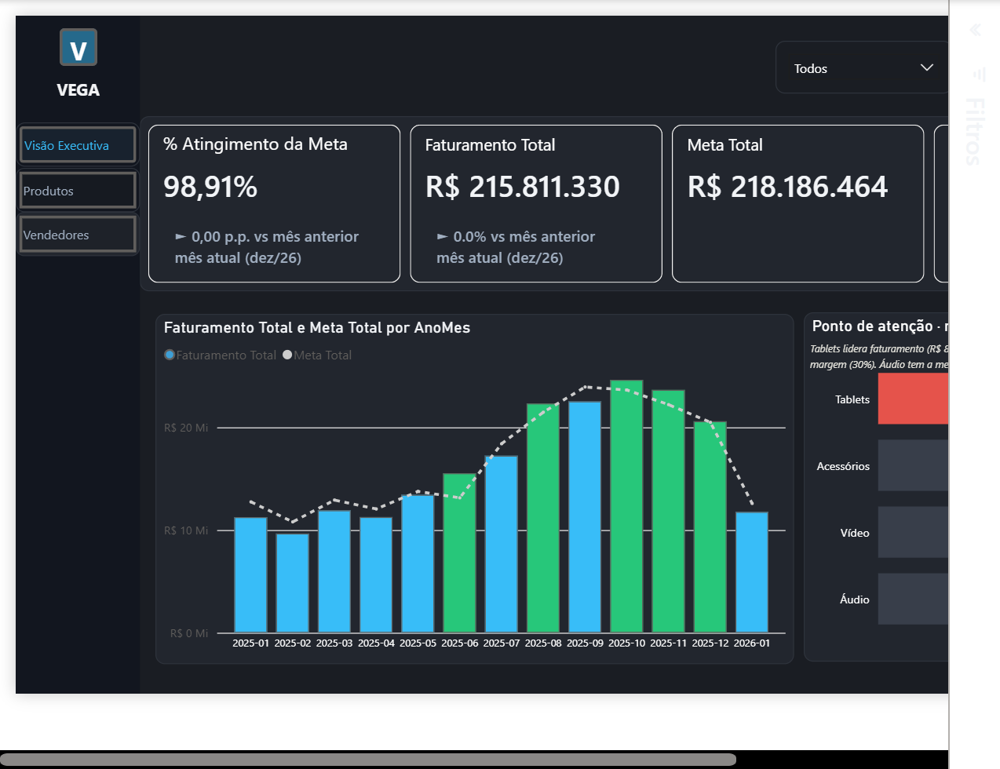
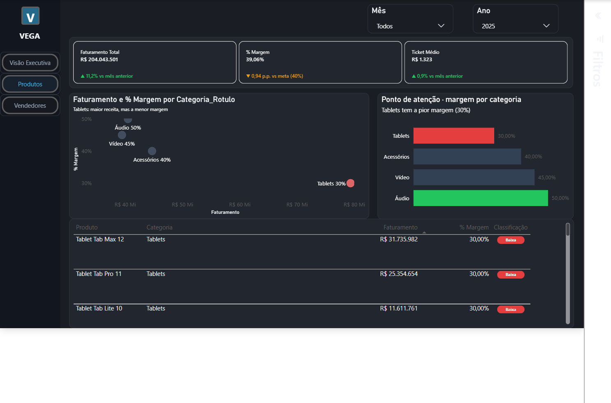
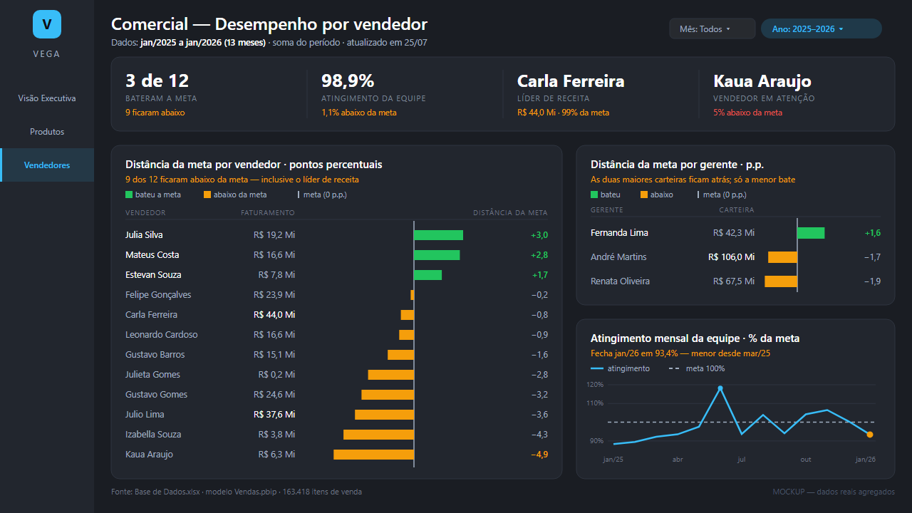

# VEGA — Painel de Vendas em Power BI

**Estudo de caso de análise de dados**: uma distribuidora fictícia de eletrônicos, uma pergunta de negócio, e a descoberta que ela escondia.

🔴 **[Ver o dashboard ao vivo](https://app.powerbi.com/view?r=eyJrIjoiZTYzMjVjNjctY2NjYi00Y2UyLTgxOTYtNmI4M2EzMzQzY2I0IiwidCI6IjY1OWNlMmI4LTA3MTQtNDE5OC04YzM4LWRjOWI2MGFhYmI1NyJ9)**

---

## A pergunta

> Quem realmente traz resultado — não só receita, mas margem?

A VEGA é uma distribuidora fictícia de eletrônicos (tablets, áudio, vídeo, acessórios). A resposta que os dados dão tem uma pegadinha:

**Tablets lidera o faturamento da empresa (38% de toda a receita). É exatamente por isso que a margem está sendo drenada — é a categoria com a pior margem de todas (30%, contra 50% de Áudio).**

## O painel

| Faturamento 2025 | % Margem 2025 | Categoria líder | Pior margem |
|---|---|---|---|
| R$ 204,0 Mi | 39,06% (▼0,94 p.p. vs meta) | Tablets · 38% da receita | Tablets · 30% |

### Visão Executiva
KPIs de atingimento de meta, faturamento e margem, comparativo Faturamento × Meta mês a mês, e ranking de margem por categoria.



### Produtos
Dispersão faturamento × margem por categoria, alerta visual de ponto de atenção, e tabela de ranking de produtos com classificação de margem — desce da categoria até o produto específico.



### Vendedores
Atingimento de meta por vendedor e por gerente, e evolução mensal da equipe — 9 dos 12 vendedores ficam abaixo da meta, inclusive a própria líder de receita.



## Como foi construído

- **Modelagem:** modelo estrela em Power BI — fatos de vendas e metas, dimensões de produto, vendedor e calendário
- **DAX:** medidas de comparativo mensal (mês atual vs. mês anterior), cor condicional via medida, ranking dinâmico por categoria
- **Formato:** projeto PBIP (arquivos versionáveis por página/visual/medida, não `.pbix` binário)
- **Dado:** 163 mil linhas de venda simuladas, jan/2025 a jan/2026 — base 100% fictícia, feita para portfólio
- **Ferramental:** Power BI Desktop, com apoio do Claude Code para acelerar modelagem e formatação de visuais — toda decisão de negócio e validação de número, sempre manual

### Um detalhe técnico que a maioria erra

Toda comparação entre dois percentuais neste painel usa **pontos percentuais (p.p.)**, não % relativo — são coisas diferentes. `39,06% − 40% = −0,94 p.p.`, não "−0,94%". Confundir os dois é o erro de leitura mais comum em relatório de negócio.

## Estrutura do repositório

```
Vendas.pbip                 → arquivo raiz do projeto (abre no Power BI Desktop)
Vendas.Report/               → definição do relatório (páginas, visuais)
Vendas.SemanticModel/        → modelo semântico (tabelas, medidas DAX, relacionamentos)
Base de Dados.xlsx           → fonte de dados (fictícia)
docs/screenshots/            → capturas das 3 páginas
Roteiro-Apresentacao.md      → roteiro de apresentação rápida do projeto
```

## Dados

Todos os dados (empresa, produtos, vendedores, clientes) são fictícios, gerados para fins de portfólio. Qualquer semelhança com empresas reais é coincidência.

---

**Lucas Magalhães** · Análise de Dados / Power BI
